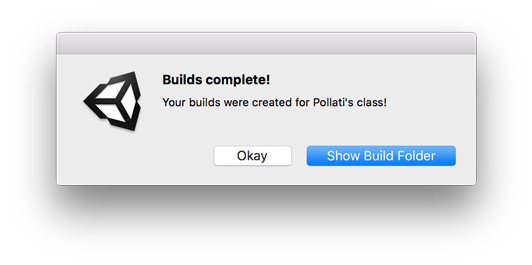
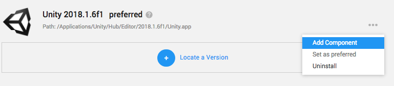
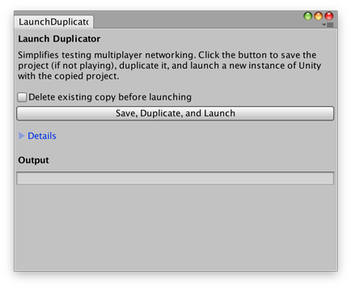

# Professor Pollati's Unity Utilities
This repo contains the Unity Editor scripts that can be used in my classes to help make some task as simple as a menu choice. These editor scripts work on both Mac and Windows.

Feel free to use these in your own projects.

## Releases
In the [Releases](https://github.com/ProfPollati/ProfPollatiUnityUtilities/releases), you will find the latest ProfPollatiUtilities.unitypackage which will contains all the files you need. Just go in the menu **Assets** -> **Import Package** -> **Custom Package** and select the unity package.

## The Scripts

### Build Buddy
This basic script will produce the universal Linux, Mac, and Windows (32bit and 64bit) builds and zip them for you. That way, you have the required releases, all named properly for the GitHub Releases required for submitting in your project.

Once it completes, it will pop open a requester where you can hit _Okay_ or _Show Build Folder_ to have the Build folder show up in Explorer on Windows or in the Finder for Mac.

#### Missing Builds!?!

If you do not have all the required build support installed (Windows Build Support, Linux Build Support, and Mac Build Support) for Unity, the completion message will tell you which builds did not get genrated. 

In order to enable those build:

If you are using Unity Hub, you can easily add the components missing:

Otherwise, you have to launch the Unity Download Assistant and manually select those. (For info [see "No mac build option on PC?"](http://answers.unity3d.com/questions/1114042/no-mac-build-option-on-pc.html))

#### Other Notes
In order to easily produce a ZIP file with Unity 5.4 or lower, the library [Ionic.Zip.Unity](https://github.com/r2d2rigo/dotnetzip-for-unity) from https://github.com/r2d2rigo/dotnetzip-for-unity in needed in the Assets/Plugin/ folder.

### Launch Duplicator
*NOTE: Not yet tested with Unity Hub*

When trying to test out your project for the Multiplayer assignments, you either have to make a build of the game and launch that build and launch the editor, or you can make a duplicate of your project and launch that in another instance of Unity. Launching another instance makes it a little faster to changing things around, but it can take more time to copy the files, _unless_ you use this script.

This will add a window with controls for you to **Save, Duplicate and Launch**. If you are running the game, it will only **Duplicate and Launch**. You cannot save the scenes or project since it may lead to issue with project. 

Expanding the Details will tell you the location of the project, where it gets duplicated to, and the location of Unity's executable which you can edit incase your is in a different location.
